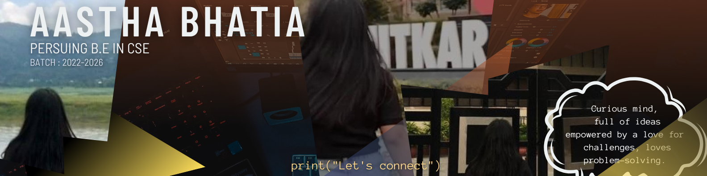

  

# 💫 About Me:
🔭 I’m currently working on: Creating Web Applications 👯 I’m looking to collaborate on: Projects 🤝 I’m looking for help with: Internship Opportunities 🌱 I’m currently learning: Dara Structures & Algorithms 💬 Ask me about: Programming, Projects, DSA, Web Applications, UI-UX, GUI Development, Game Design & Development ⚡ Fun fact: I study a day before my exams XD

## 🌐 Socials:
  

# 💻 Tech Stack:
                
# 📊 GitHub Stats:
 
 

## 🏆 GitHub Trophies

## ✍️ Random Dev Quote  

  
✍️ Random Dev Quote

  <blockquote>
    "Readability of code is now my first priority than being fast..."
  </blockquote>

 

## 🔝 Top Contributed Repo

## 📫 Contact Me:
📧 Email: [aasthabhatia.er@gmail.com](mailto:aasthabhatia.er@gmail.com)  
💼 LinkedIn: [Aastha Bhatia](https://www.linkedin.com/in/aasthabhatia-er/)  

---
