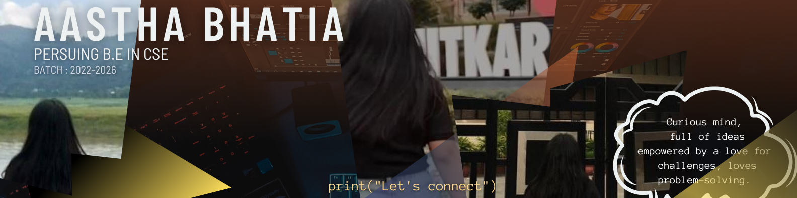

  

# 💫 About Me:
🔭 I’m currently working on: Creating web applications. 👯 I’m looking to collaborate on: Projects. 🤝 I'd appreciate: Jobs and Internship Opportunities. 🌱 I’m currently learning: Web development. 💬 Ask me about: Programming, Projects, DSA, Web Applications, UI-UX, GUI Development, Game Design & Development  ⚡ Fun fact: I love food more than humans. 🌯🍱🍜🍲

## 🌐 Socials:
   

# 💻 Tech Stack:
                
# 📊 GitHub Stats:
 
 

## 🏆 GitHub Trophies

### ✍️ Random Dev Quote

### 🔝 Top Contributed Repo

---

